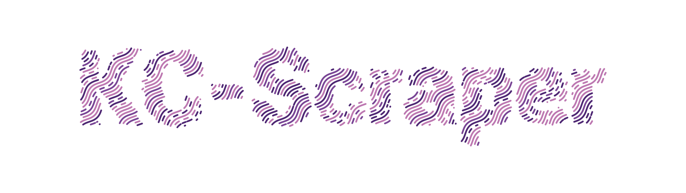
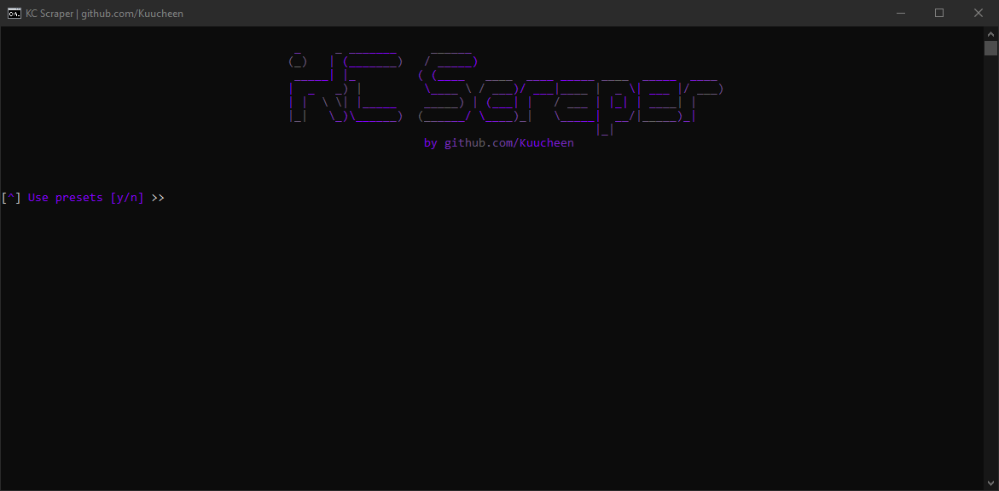

---

# 
👾 KC-Scraper 👾

 

<strong>A powerful and open source proxy scraper   able to scrape from almost any website </strong>

 

 

 
 

-----

### 
☄ Features ☄

 

    • Threads
                     
    • Very fast

    • Highly customizable
    
    • Custom proxy delimiter

    • Settings for automatisation
                     
    • Presets get ~200 elite proxies

    • Automatically removes duplicates

 

-----

### 
❓ How to use ❓

 

     1. Place your proxy sites in the "sites.txt" file or create configs in the "presets" folder.

     2. Ensure that the website you choose is capable of displaying proxies. For instance, you can use 
        the following example site: https://openproxy.space/list/http.

     3. (secret) Pro tip: Don't forget to add "http://" or "https://" before the website URL.
 

-----

### 
🔩 Requirements 🔩

 

<strong>Use `python -m pip install -r requirements.txt` to install

`httpx[http2]`
`pystyle`
`pyyaml`

<a href="https://www.python.org/">Python3</a> or higher
 

----
### 
📌 Other 📌

                                  

<strong>this tool is made for educational purposes only</strong>  if you have ideas or better websites make a pull request

